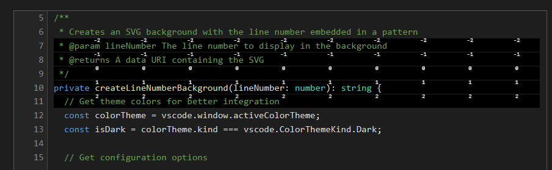

# Double Line Numbers - Dynamic Line Highlighting

This fork adds dynamic line highlighting with embedded relative line numbers to the original Double Line Numbers extension.

## Dynamic Line Highlighting



This feature helps you keep focus on your code without having to look at line numbers in the gutter:

- **Solid Black Background**: Highlights your current line with a distinctive background
- **Embedded Relative Numbers**: Shows relative line numbers (-9 to 9) directly in the background
- **Enhanced Focus**: Keep your eyes on the code instead of looking at the gutter

## Usage

Enable/disable via command palette: `Double Line Numbers: Toggle Line Highlight`

## Configuration

* `vscode-double-line-numbers.enableLineHighlight`: Enable/disable line highlighting feature
* `vscode-double-line-numbers.highlight.patternOpacity`: Opacity of the background pattern (0-1)
* `vscode-double-line-numbers.highlight.showLineNumber`: Show/hide the central line number in the background

## Repository Structure

```
vscode-double-line-numbers/
├── README.md                # Clean, focused landing page
├── images/                  # Contains demo images
│   └── demo-image.png       # Main feature demonstration
└── source/                  # All implementation files
    ├── src/                 # Source code
    ├── demo/                # Demo files
    ├── package.json         # Project configuration
    └── ...                  # Other development files
```

## Source Code

All source code and development files are available in the [source](source/) directory.
